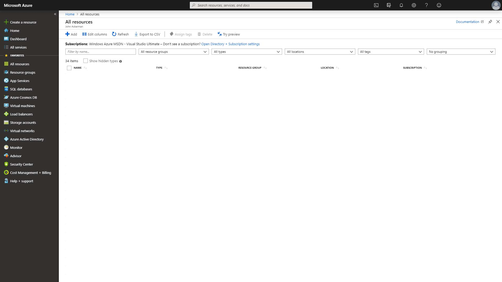

# Azure Cosmos DB Change Feed

In this lab you will use the Change Feed Procesor Library and Azure Functions to implement three use cases for the Azure Cosmos DB Change Feed

## Prerequisites

In order to successfully complete this lab you will need the latest .NET Core SDK, and a text editor suitable for programming. This lab will use Visual Studio Code, an open source IDE provided by Microsoft.

To get started with the .NET Core SDk, [Follow this Tutorial](https://aka.ms/dotnetcoregs)

To download and use Visual Studio Code, [Click this Link](https://code.visualstudio.com/)

Finally, you will need a Microsoft Azure account. Free accounts are available for demo purposes. [Visit the Azure Portal](https://portal.azure.com) for details.

## Setup

> Before you start this lab you will need to set up and configure a number of Azure resources that you will use throughout the lab. The .NET SDK requires credentials to connect to your Azure accounts. You will collect and store these credentials in this step.

### Retrieve Credentials for this Lab

1. In a new browser window, sign in to the **Azure Portal** (<https://portal.azure.com>).

1. On the left side of the portal, click the **Resource Groups** link.

   

1. In the **Resource groups** blade, locate and select the **cosmosdblab-group** _Resource Group_.

   

1. In the **cosmosdblab-group** blade, select the Cosmos DB Account that was created.

   

1. On the left side of the **Azure Cosmos DB** blade, locate the **Settings** section and click the **Keys** link.

   

1. In the **Keys** pane, record the values in the **PRIMARY CONNECTION STRING**, **URI** and **PRIMARY KEY** fields. You will use these values later in this lab.

   

## Build A .NET Console App to Generate Data

_In order to simulate data flowing into our store, in the form of actions on an ecommerce website, we'll build a simple .NET Console App to generate and add documents to our Cosmos DB CartContainer_

1. On your local machine, create a new folder that will be used to contain the content of your .NET Core project.

1. Open a terminal window and navigate to the folder that you created in the previous step

1. In the terminal window, enter and execute the following command:

   ```sh
   dotnet new console -o DataGenerator
   ```

> This command will create a new .NET Core 2.2 project. This project will be a **console** project and the project will be crated in a new directory called **DataGenerator**

1.  Change directory to the **DataGenerator** folder

1.  In the terminal pane, enter and execute the following command:

    ```sh
    dotnet add package Microsoft.Azure.Cosmos --version 3.0.0.17-preview
    ```

    > This command will add the [Microsoft.Azure.Cosmos](https://www.nuget.org/packages/Microsoft.Azure.Cosmos/) NuGet package as a project dependency.

1.  In the terminal pane, enter and execute the following command:

    ```sh
    dotnet add package Bogus --version 27.0.1
    ```

    > This command will add the [Bogus]() NuGet package, which you'll use to generate randomized shopping data.

1.  Change directory back to your root folder

1.  In the terminal pane, open Visual Studio code with the following command:

    ```sh
    code .
    ```

1.  Observe the **Program.cs** and **DataGenerator.csproj** files created by the .NET Core CLI.

    

1.  Double-click the **DataGenerator.csproj** link in the **Explorer** pane to open the file in the editor.

1.  Add a new **PropertyGroup** XML element to the project configuration within the **Project** element:

    ```xml
    <PropertyGroup>
        <LangVersion>Latest</LangVersion>
    </PropertyGroup>
    ```

1.  Your new XML should look like this:

    ```xml
    <Project Sdk="Microsoft.NET.Sdk">
        <PropertyGroup>
            <OutputType>Exe</OutputType>
            <TargetFramework>netcoreapp2.2</TargetFramework>
        </PropertyGroup>
        <PropertyGroup>
            <LangVersion>Latest</LangVersion>
        </PropertyGroup>
        <ItemGroup>
            <PackageReference Include="Bogus" Version="27.0.1" />
            <PackageReference Include="Microsoft.Azure.Cosmos" Version="3.0.0.17-preview" />
        </ItemGroup>
    </Project>
    ```

1.  Double-click the **Program.cs** link in the **Explorer** pane to open the file in the editor.

    

### Create Function to Add Documents to Cosmos DB

_The key functionality of the console application is to add documents to our Cosmos DB to simulate activity on our ecommerce website. Here, you'll create a data definition for these documents and define a function to add them_

1. Within the **Program.cs** editor tab, Add the following using blocks to the top of the editor:

   ```csharp
   using System.Threading.Tasks;
   using Microsoft.Azure.Cosmos;
   using Newtonsoft.Json;
   using Newtonsoft.Json.Converters;
   ```

1. Locate the **Program** class and replace it with the following class:

   ```csharp
   public class Program
   {
       public static async Task Main(string[] args)
       {
       }
   }
   ```

1. Within the **Program** class, add the following lines of code to create variables for your connection information:

   ```csharp
   private static readonly string _endpointUrl = "";
   private static readonly string _primaryKey = "";
   private static readonly string _databaseId = "StoreDatabase";
   private static readonly string _containerId = "CartContainer";
   ```

1. For the `_endpointUrl` variable, replace the placehodler value with the **URI** value for your Azure Cosmos DB account that you recorded earlier in this lab.

1. For the `_primaryKey` variable, replace the placeholder value with the **PRIMARY KEY** value from your Azure Cosmos DB account that you recorded earlier in this lab.

1. Location the **Main** method:

   ```csharp
   public static async Task Main(string[] args)
   {
   }
   ```

1. After the **Main** method, define the **CartAction** class and an enum called **ActionType**.

   ```csharp
   public enum ActionType
   {
       Viewed,
       Added,
       Purchased
   }

   public class CartAction
   {
       [JsonProperty("id")]
       public string Id {get; set;}
       public int CartId {get; set;}
       [JsonConverter(typeof(StringEnumConverter))]
       public ActionType Action {get; set;}
       public string Item {get; set;}
       public double Price {get; set;}
       public string BuyerState {get; set;}

       public CartAction()
       {
           Id = Guid.NewGuid().ToString();
       }
   }
   ```

   > The `id` property is required by Cosmos DB to be a string that is not greater than 255 chars and unique in the container. We auto-generate the id here in the constructor as a **GUID** to ensure uniqueness.

1. In between the **Main** method and the class definitions, add the following function:

   ```csharp
   private static async Task AddItem(CartAction item)
   {
       using(var client = new CosmosClient(_endpointUrl, _primaryKey))
       {
           var db = client.GetDatabase(_databaseId);
           var container = db.GetContainer(_containerId);

           await container.CreateItemAsync(item, new PartitionKey(item.Item));
       }
   }
   ```

   > The **CosmosClient** class is the main entry point to the API for Azure Cosmos DB. You'll see this pattern again any time we are communicating with our Cosmos DB throughout this lab.

### Create a Function to Generate Random Shopping Data

_Now that you have a function to add documents to Cosmos DB you'll need a way to generate those documents. We'll use the *Randomizer* class in the Bogus library to help with this step_

1. Within the **Program.cs** editor tab, add the following using block to the top of the editor:

   ```csharp
   using Bogus;
   using System.Collections.Generic;
   ```

1. The full list of using should now look like this:

   ```csharp
   using System;
   using System.Threading.Tasks;
   using Microsoft.Azure.Cosmos;
   using Newtonsoft.Json;
   using Newtonsoft.Json.Converters;
   using Bogus;
   using System.Collections.Generic;
   ```

1. In between the **Main** method and the **AddItem** function, add a new function:

   ```csharp
   private static List<CartAction> GenerateActions()
   {
       Randomizer random = new Randomizer();

       var items = new string[]{};
       var states = new string[]{};
       var prices = new double[]{};

       var actions = new List<CartAction>();

       // create actions

       return actions;
   }
   ```

   > There are three collections in this function, `items`, `states` and `prices` that will be used to generate cart actions. The initial value of these collections are ommitted for now to make the code easier to read. We'll add them in a few steps.

1. The next steps will focus on the lines where the comment `// create actions` is currently sitting.

1. In order to generate a random item, we'll use Randomizer to select an item and state index for our new item, and create a CartAction based on those values. Add the following code after `// create actions`.

   ```csharp
   var itemIndex = random.Number(0, items.Length - 1);
   var stateIndex = random.Number(0, states.Length - 1);

   var action = new CartAction
   {
       CartId = random.Number(1000, 99999),
       Action = random.Enum<ActionType>(),
       Item = items[itemIndex],
       Price = prices[itemIndex],
       BuyerState = states[stateIndex]
   };
   ```

1. If the action is anything other than **Viewed** we need to add the previous action(s) that led up to this action. To do that, add the following code snippet:

   ```csharp
   if(action.Action != ActionType.Viewed)
   {
       var previousActions = new List<ActionType> {ActionType.Viewed};

       if(action.Action != ActionType.Purchased)
       {
           previousActions.Add(ActionType.Added);
       }

       foreach(var previousAction in previousActions)
       {
           var previous = new CartAction
           {
               CartId = action.CartId,
               Action = previousAction,
               Item = action.Item,
               Price = action.Price,
               BuyerState = action.BuyerState
           };

           actions.Add(previous);
       }
   }

   ```

1. Finally, we'll add the new action to the list of actions, prior to returning:

   ```csharp
   actions.Add(action);
   ```

1. The **GenerateActions** function should now look like this:

   ```csharp
    private static List<CartAction> GenerateActions()
    {
        Randomizer random = new Randomizer();

        var items = new string[]{};

        var states = new string[]{};

        var prices = new double[]{};

        var actions = new List<CartAction>();

        var itemIndex = random.Number(0, items.Length - 1);
        var stateIndex = random.Number(0, states.Length - 1);

        var action = new CartAction
        {
            CartId = random.Number(1000, 99999),
            Action = random.Enum<ActionType>(),
            Item = items[itemIndex],
            Price = prices[itemIndex],
            BuyerState = states[stateIndex]
        };

        if (action.Action != ActionType.Viewed)
        {
            var previousActions = new List<ActionType> { ActionType.Viewed };

            if (action.Action == ActionType.Purchased)
            {
                previousActions.Add(ActionType.Added);
            }

            foreach (var previousAction in previousActions)
            {
                var previous = new CartAction
                {
                    CartId = action.CartId,
                    Action = previousAction,
                    Item = action.Item,
                    Price = action.Price,
                    BuyerState = action.BuyerState
                };

                actions.Add(previous);
            }
        }

        actions.Add(action);
        return actions;
    }
   ```

1. In order to have actual data, you'll need to assign the values of `items`, `states` and `prices` to some test data. Modify those lines as follows:

   ```csharp
   var items = new string[]
       {
           "Unisex Socks", "Women's Earring", "Women's Necklace", "Unisex Beanie",
           "Men's Baseball Hat", "Unisex Gloves", "Women's Flip Flop Shoes", "Women's Silver Necklace",
           "Men's Black Tee", "Men's Black Hoodie", "Women's Blue Sweater", "Women's Sweatpants",
           "Men's Athletic Shorts", "Women's Athletic Shorts", "Women's White Sweater", "Women's Green Sweater",
           "Men's Windbreaker Jacket", "Women's Sandal", "Women's Rainjacket", "Women's Denim Shorts",
           "Men's Fleece Jacket", "Women's Denim Jacket", "Men's Walking Shoes", "Women's Crewneck Sweater",
           "Men's Button-Up Shirt", "Women's Flannel Shirt", "Women's Light Jeans", "Men's Jeans",
           "Women's Dark Jeans", "Women's Red Top", "Men's White Shirt", "Women's Pant", "Women's Blazer Jacket", "Men's Puffy Jacket",
           "Women's Puffy Jacket", "Women's Athletic Shoes", "Men's Athletic Shoes", "Women's Black Dress", "Men's Suit Jacket", "Men's Suit Pant",
           "Women's High Heel Shoe", "Women's Cardigan Sweater", "Men's Dress Shoes", "Unisex Puffy Jacket", "Women's Red Dress", "Unisex Scarf",
           "Women's White Dress", "Unisex Sandals", "Women's Bag"
       };

       var states = new string[]
       {
           "AL","AK","AS","AZ","AR","CA","CO","CT","DE","DC","FM","FL","GA","GU","HI","ID","IL","IN",
           "IA","KS","KY","LA","ME","MH","MD","MA","MI","MN","MS","MO","MT","NE","NV","NH","NJ","NM",
           "NY","NC","ND","MP","OH","OK","OR","PW","PA","PR","RI","SC","SD","TN","TX","UT","VT","VI",
           "VA","WA","WV","WI","WY"
       };

       var prices = new double[]
       {
           3.75, 8.00, 12.00, 10.00,
           17.00, 20.00, 14.00, 15.50,
           9.00, 25.00, 27.00, 21.00, 22.50,
           22.50, 32.00, 30.00, 49.99, 35.50,
           55.00, 50.00, 65.00, 31.99, 79.99,
           22.00, 19.99, 19.99, 80.00, 85.00,
           90.00, 33.00, 25.20, 40.00, 87.50, 99.99,
           95.99, 75.00, 70.00, 65.00, 92.00, 95.00,
           72.00, 25.00, 120.00, 105.00, 130.00, 29.99,
           84.99, 12.00, 37.50
       };
   ```

### Putting it all together

_At this point, all that is left is to call the function to generate the data from your console application, and pass the result to our AddItem function for persistence._

1. Locate the **Main** method

   ```csharp
   static async Task Main(string[] args)
   {
   }
   ```

1. Within the **Main** method, add the following code:

   ```csharp
   Console.WriteLine("Press any key to stop the console app...");

   var tasks = new List<Task>();

   while(!Console.KeyAvailable)
   {
       foreach(var action in GenerateActions())
       {
           tasks.Add(AddItem(action));
           Console.Write("*");
       }
   }

   await Task.WhenAll(tasks);
   ```

   > This code uses the console to print an asterisk each time a record is written, just to help us keep track of progress. Pressing any key will stop the console app.

### Run the Console App and Verify Functionality

_You're ready to run the console app, and in this step you'll take a look at you Cosmos DB account to ensure test data is being written as expected._

1. Open a terminal window, and navigate to the **DataGenerator** folder from the previous step.

1. In the terminal pane, enter and execute the following command to run your console app:

   ```sh
   dotnet run
   ```

1. After a brief build process, you should begin to see the asterisks being printed as data is being generated and written to Cosmos DB.

   

1. Let the console app run for a minute or two and then stop it by pressing any key in the console.

1. Follow the previous steps to navigate back to your **cosmosdblab** Cosmos DB Account.

1. From within the **Azure Cosmos DB** blade, select the **Data Explorer** tab on the left.

   

1. Expand the **StoreDatabase** then the **CartContainer** and select **Items** If all goes well, you should see something like the following screenshot.

   _Note your data will be slightly different since it is random, the important thing is that there is data here at all_

   

## Consume Cosmos DB Change Feed via the Change Feed Processor

_The two main options for consuming the Cosmos DB change feed are Azure Functions and the Change Feed Processor library. We'll start with the Change Feed Processor via a simple console application_

### Create a .NET Console Application

1. Open a terminal window and navigate to the root folder you created previously

1. In the terminal window, enter and execute the following command:

   ```sh
   dotnet new console -o ChangeFeedConsole
   ```

> This command will create a new .NET Core 2.2 project. This project will be a **console** project and the project will be crated in a new directory called **ChangeFeedConsole**

1.  Change directory to the **ChangeFeedConsole** folder

1.  In the terminal pane, enter and execute the following command:

    ```sh
    dotnet add package Microsoft.Azure.Cosmos --version 3.0.0.17-preview
    ```

    > This command will add the [Microsoft.Azure.Cosmos](https://www.nuget.org/packages/Microsoft.Azure.Cosmos/) NuGet package as a project dependency.

1.  Change directory back to your root folder

1.  In the terminal pane, open Visual Studio code with the following command:

    ```sh
    code .
    ```

1.  Observe the **Program.cs** and **ChangeFeedConsole.csproj** files created by the .NET Core CLI.

1)  Double-click the **ChangeFeedConsole.csproj** link in the **Explorer** pane to open the file in the editor.

1)  Add a new **PropertyGroup** XML element to the project configuration within the **Project** element:

    ```xml
    <PropertyGroup>
        <LangVersion>Latest</LangVersion>
    </PropertyGroup>
    ```

1)  Your new XML should look like this:

    ```xml
    <Project Sdk="Microsoft.NET.Sdk">
        <PropertyGroup>
            <OutputType>Exe</OutputType>
            <TargetFramework>netcoreapp2.2</TargetFramework>
        </PropertyGroup>
        <PropertyGroup>
            <LangVersion>Latest</LangVersion>
        </PropertyGroup>
        <ItemGroup>
            <PackageReference Include="Microsoft.Azure.Cosmos" Version="3.0.0.17-preview" />
        </ItemGroup>
    </Project>
    ```

1)  Double-click the **Program.cs** link in the **Explorer** pane to open the file in the editor.

### Connect to Cosmos DB

1. At the top of the **Program.cs** file add the following using statements:

   ```csharp
   using System.Collections.Generic;
   using System.Threading;
   using System.Threading.Tasks;
   using Microsoft.Azure.Cosmos
   ```

1. Modify the **Program** class definition as follows:

   ```csharp
   class Program
   {
       private static readonly string _endpointUrl = "<your-endpoint-url>";
       private static readonly string _primaryKey = "<your-primary-key>";
       private static readonly string _databaseId = "StoreDatabase";
       private static readonly string _containerId = "CartContainer";

       public static async Task Main(string[] args)
       {
           //code goes here
       }
   }
   ```

   > Be sure to replace the values for `<your-endpoint-url>` and `<your-primary-key>` with the keys you retrieved from your Cosmos DB account previously.

1. Modify the **Main** method to connect to the source container, by adding the following code:

   ```csharp
   using(var client = new CosmosClient(_endpointUrl, _primaryKey))
   {
       var db = client.GetDatabase(_databaseId);
       var container = db.GetContainer(_containerId);

       //code continues here
   }
   ```

### Connect to the Cosmos DB Change Feed

_The first use case we'll explore for Cosmos DB Change Feed is Live Migration. A common concern when designing a Cosmos DB container is proper selection of a partition key. You'll recall that we created our CartContainer with a partition key of /Item. What if we find out later this key is wrong? Or what if writes work better with /Item while reads work better with /BuyerState as the partition key? We can avoid analysis paralysis by using Cosmos DB Change Feed to migrate our data in real time to a second container with a different partition key!_

1. Add one more configuration value to the top of the **Program.cs** file, for the name of the destination container, following `_containerId`:

   ```csharp
   private static readonly string _destinationContainerId = "CartContainerByState";
   ```

   > In this case we are going to migrate our data to another container within the same database. The same ideas apply even if we wanted to migrate our data to another database entirely.

1. In order to consume the change feed we make use of a **Lease Container**. Add the following lines of code in place of `//code continues here` to create the lease container:

   ```csharp
   CosmosContainer leaseContainer = await db.CreateContainerIfNotExists(
       id: "consoleLeases",
       partiionKey: "/id",
       requestUnitsPerSecond: 400
   );
   ```

   > The **Lease Container** stores information to allow for parallel processing of the change feed, and acts as a book mark for where we last processed changes from the feed.

1. Now, add the following lines of code directly after the **leaseContainer** definition in order to create an instance of the change processor:

   ```csharp
   var builder = container.CreateChangeFeedProcessorBuilder("migrationProcessor", async (IReadOnlyCollection<object> input, CancellationToken cancellationToken) => {
       Console.WriteLine(input.Count + " Changes Received");
       //todo: Add processor code here
   });

   var processor = builder
                   .WithInstanceName("changeFeedConsole")
                   .WithLeaseContainer(leaseContainer)
                   .Build();
   ```

   > Each time a set of changes is recieved, the Func<T> defined in **CreateChangeFeedProcessorBuilder** will be called. We're skipping the handling of those changes for the moment.

1. In order for our processor to run, we have to start it. Following the definition of **processor** add the following lines of code:

   ```csharp
   await processor.StartAsync();
   Console.WriteLine("Started Change Feed Processor");
   Console.WriteLine("Press any key to stop the processor...");

   Console.ReadKey();

   Console.WriteLine("Stopping Change Feed Processor");
   await processor.StopAsync();
   ```

1. At this point, your **Program.cs** file should look like this:

   ```csharp
   using System;
   using System.Collections.Generic;
   using System.Threading;
   using System.Threading.Tasks;
   using Microsoft.Azure.Cosmos;

   namespace ChangeFeedConsole
   {
       class Program
       {
           private static readonly string _endpointUrl = "<your-endpoint-url>";
           private static readonly string _primaryKey = "<your-primary-key>";
           private static readonly string _databaseId = "StoreDatabase";
           private static readonly string _containerId = "CartContainer";

           private static readonly string _destinationContainerId = "CartContainerByState";

           static async Task Main(string[] args)
           {
               using (var client = new CosmosClient(_endpointUrl, _primaryKey))
               {
                   var db = client.GetDatabase(_databaseId);
                   var container = db.GetContainer(_containerId);
                   var destinationContainer = db.GetContainer(_destinationContainerId);

                   CosmosContainer leaseContainer = await db.CreateContainerIfNotExistsAsync(
                       id: "consoleLeases",
                       partitionKeyPath: "/id",
                       requestUnitsPerSecond: 400);

                   var builder = container.CreateChangeFeedProcessorBuilder(
                       "migrationProcessor",
                       async (
                           IReadOnlyCollection<object> input,
                           CancellationToken cancellationToken) =>
                   {
                       Console.WriteLine(input.Count + " Changes Received");
                       //todo: Add processor code here
                   });

                   var processor = builder
                                   .WithInstanceName("changeFeedConsole")
                                   .WithLeaseContainer(leaseContainer)
                                   .Build();

                   await processor.StartAsync();
                   Console.WriteLine("Started Change Feed Processor");
                   Console.WriteLine("Press any key to stop the processor...");

                   Console.ReadKey();

                   Console.WriteLine("Stopping Change Feed Processor");
                   await processor.StopAsync();
               }
           }
       }
   }
   ```

### Create a Shared Project to Share Data Definitions

_The Change Feed console app we just created is going to need access to the defintions of the CartAction and ActionType enum that we defined in our data generation console app. To promote sharing, you'll create a new Shared class library and move the data definitions there._

1. Open your terminal window, and change directory to the root folder you created for this lab.

1. In the terminal pane, enter and execute the following command:

   ```sh
   dotnet new classlib -o Shared
   ```

1. Add a reference to **Shared** from the **DataGenerator** project by entering and executing the following command:

   ```sh
   dotnet add DataGenerator\\DataGenerator.csproj reference shared\\shared.csproj
   ```

1. Add a refernece to **Shared** from the **ChangeFeedConsole** project by entering and executing the following command:

   ```sh
   dotnet add ChangeFeedConsole\\ChangeFeedConsole.csproj reference shared\\shared.csproj
   ```

1. Change directory to the new Shared project

1. In the open terminal pane, enter and execute the following command

   ```sh
   dotnet add package Newtonsoft.Json --version 11.0.2
   ```

1. Return to Visual Studio Code and note the new **Shared** folder.

1. Rename the generated **Class1.cs** file under **Shared** to **DataModels.cs**

1. Open the **DataModels.cs** class and add the following usings:

   ```csharp
   using Newtonsoft.Json;
   using Newtonsoft.Json.Converters;
   ```

1. Open the **Program.cs** file from the **DataGenerator** folder and cut the **ActionType** enum and **CartAction** class definitions.

1. Paste those class definitions into the **DataModels.cs** file overwiting the **Class1** definition. **DataModels.cs** should now look like this:

   ```csharp
    using System;
    using Newtonsoft.Json;
    using Newtonsoft.Json.Converters;

    namespace Shared
    {
        public enum ActionType
            {
                Viewed,
                Added,
                Purchased
            }

            public class CartAction
            {
                [JsonProperty("id")]
                public string Id { get; set; }

                public int CartId { get; set; }
                [JsonConverter(typeof(StringEnumConverter))]
                public ActionType Action { get; set; }
                public string Item { get; set; }
                public double Price { get; set; }
                public string BuyerState { get; set; }

                public CartAction()
                {
                    Id = Guid.NewGuid().ToString();
                }

            }
    }
   ```

1. In the **Program.cs** file of both **DataGenerator** and **ChangeFeedConsole** add the following using:

   ```csharp
   using Shared;
   ```

   > You may also remove the usings for Newtonsoft.Json and Newtonsoft.Json.Converters from the **DataGenerator** project if you wish.

### Complete the Live Data Migration

1. In Visual Studio code open the **Program.cs** file within **ChangeFeedConsole**

1. Locate the todo we left ourselves `//todo: Add processor code here`

1. Modify the signature of the Func<T> in the **CreateChangeFeedProcessorBuilder** replacing `object` with `CartAction` as follows:

   ```csharp
   var builder = container.CreateChangeFeedProcessorBuilder(
                      "migrationProcessor", async (
                          IReadOnlyCollection<CartAction> input,
                          CancellationToken cancellationToken) =>
       {
           Console.WriteLine(input.Count + " Changes Received");
           //todo: Add processor code here
       });
   ```

1. The **input** is a collection of **CartAction** documents that have changed. To migrate them, we'll simply loop through them and write them out to our destination container. Replace the `//todo` with the following code:

   ```csharp
   foreach (var doc in input)
   {
       await destinationContainer.CreateItemAsync(doc, new PartitionKey(doc.BuyerState));
   }
   ```

### Test to Confirm the Change Feed Function Works

_Now that we have our first Change Feed consumer, we're ready to run a test and confirm that it works_

1. Open a **second** terminal window and navigate to the **ChangeFeedConsole** folder

1. Start up your console app by running the following command in the **second** terminal window:

   ```sh
   dotnet run
   ```

1. Once the function starts running you'll see the following messages in your console:

   ```sh
   Started Change Feed Processor
   Press any key to stop the processor...
   ```

   > Because this is the first we've run this consumer, there will be no data to consume. We'll start the data generator in order to start receiving changes.

1. In the **first** terminal window, navigate to the **DataGenerator** folder

1. Start the **DataGenerator** again by running the following command in the **first** terminal window

   ```sh
   dotnet run
   ```

1. You should see the asterisks start to appear again as the data is being written.

1. Soon after data starts being written, you'll start to see the following output in the **second** terminal window:

   ```sh
   10 Changes Received
   1 Changes Received
   3 Changse Received
   ...
   ```

1. After a few minutes, navigate to the **cosmosdblab** Data Explorer and expand **StoreDatabase** then **CartContainerByState** and click **Items**. You should see items populating there, and note that the Partition Key this time is /BuyerState.

   

1. Press any key in the **first** terminal to stop data generation

1. Let the **ChangeFeedConsole** finish running (it shouldn't take very long). You'll know it's done when it stops writing new log messages. Stop the function by pressing any key in the **second** terminal window.

> You've now written your first Cosmos DB Change Feed consumer, which writes live data to a new collection. Congrats! In the next steps we'll take a look at using Azure Functions to consume Cosmos DB change feed for two additional use cases.

## Create an Azure Function to Consume Cosmos DB Change Feed

_One of the interesting features of Azure Cosmos DB is its change feed. The change feed provides support for many scenarios, three of which we'll investigate further in this lab._

### Create a .NET Core Azure Functions Project

_Azure Functions provide a quick and easy way to hook up with the Cosmos DB Change Feed in a way that is scalable out of the box. You'll start by setting up a.NET Core Azure Functions project_

1. Open a terminal window and navigate to the root folder you created for this lab.

1. To install command line support for Azure Functions, you'll need `node.js`. If you do not already have node, or you're using a version older than 8.5, [Download it here](https://docs.npmjs.com/getting-started/installing-node#osx-or-windows)

1. In your terminal pane, enter and execute the following command:

   ```sh
   npm install -g azure-functions-core-tools
   ```

   > If this command fails, refer to the previous step to setup node.js. You may need to restart your terminal window for these changes to take effect.

1. In your terminal pane, enter and execute the following command:

   ```sh
   func init ChangeFeedFunctions
   ```

   1. When prompted, choose the **dotnet** _worker runtime_

   > This command creates a new Azure Functions project

1. Change directory to the ChangeFeedFunctions directory created in the previous step

1. In your terminal pane, enter and execute the following command:

   ```sh
   func new
   ```

   1. When prompted, select **CosmosDBTrigger** from the list of templates

   2. When prompted, enter the name **MaterializedViewFunction** for the function

1. In your terminal pane, enter and execute the following command:

   ```sh
   dotnet add package Microsoft.Azure.Cosmos --version 3.0.0.17-preview
   ```

1. Your first Azure Function has been created, switch back to Visual Studio Code and note the new **ChangeFeedFunctions** folder, expand it and note **local.settings.json**, and the **MaterializedViewFunction.cs**.

## Use Cosmos DB Change Feed for the Materialized View Pattern

_The Materialized View pattern is used to generate pre-populated views of data in environments where the source data format is not well suited to the applications requirements. In this example, we'll create a real time collection of sales data aggregated by State that would allow another application to quickly retrieve summary sales data_

### Create the Materialized View Azure Function

1. Locate the **local.settings.json** file and double click it to open it in the editor.

1. Add a new value **DBConnection** using the **Primary Connection String** parameter from your Cosmos DB account collected earlier in this lab. The **local.settings.json** file should like this:

   ```json
   {
     "IsEncrypted": false,
     "Values": {
       "AzureWebJobsStorage": "UseDevelopmentStorage=true",
       "FUNCTIONS_WORKER_RUNTIME": "dotnet",
       "DBConnection": "<your-db-connection-string>"
     }
   }
   ```

1. Open Visual Studio Code and note the new **MaterializedViewFunction.cs** file. Double click it to open it in the editor.

   > The **databaseName**, **collectionName** and **ConnectionStringSetting** refer to the source Cosmos DB account that the function is listening for changes on.

1. Change the **databaseName** value to `StoreDatabase`

1. Change the **collectionName** value to `CartContainerByState`

   > Cosmos DB Change Feeds are guaranteed to be in order within a partition, so in this case we want to use the Container where the partition is already set to the State, `CartContainerByState`, as our source

1. Replace the **ConnectionStringSetting** placeholder with the new setting you added earlier **DBConnection**

   ```csharp
   ConnectionStringSetting = "DBConnection",
   ```

1. Between **ConnectionStringSetting** and **LeaseCollectionName** add the following line:

   ```csharp
   CreateLeaseCollectionIfNotExists = true,
   ```

1. Change the **LeaseCollectionName** value to `materializedViewLeases`

   > Lease collections are a critical part of the Cosmos DB Change Feed. They allow multiple instances of a function to operate over a collection and serve as a virtual _bookmark_ for where the function last left off.

1. Your **Run** function should now look like this:

   ```csharp
   [FunctionName("MaterializedViewFunction")]
   public static void Run([CosmosDBTrigger(
        databaseName: "StoreDatabase",
        collectionName: "CartContainerByState",
        ConnectionStringSetting = "DBConnection",
        CreateLeaseCollectionIfNotExists = true,
        LeaseCollectionName = "materializedViewLeases")]IReadOnlyList<Document> input, ILogger log)
    {
        if (input != null && input.Count > 0)
        {
            log.LogInformation("Documents modified " + input.Count);
            log.LogInformation("First document Id " + input[0].Id);
        }
    }
   ```

> The function works by polling your container on an interval and checking for changes since the last lease time. Each turn of the function may result in multiple documents that have changed, which is why the input is an IReadOnlyList of Documents.

1. Add the following usings to the top of the **MaterializedViewFunction.cs** file:

   ```csharp
   using System.Threading.Tasks;
   using System.Linq;
   using Newtonsoft.Json;
   using Microsoft.Azure.Cosmos;
   using Shared;
   ```

1. Modify the signature of the **Run** function to be async. Your function should now look like the following:

   ```csharp
   [FunctionName("MaterializedViewFunction")]
    public static async Task Run([CosmosDBTrigger(
        databaseName: "StoreDatabase",
        collectionName: "CartContainerByState",
        ConnectionStringSetting = "DBConnection",
        CreateLeaseCollectionIfNotExists = true,
        LeaseCollectionName = "materializedViewLeases")]IReadOnlyList<Document> input, ILogger log)
    {
        if (input != null && input.Count > 0)
        {
            log.LogInformation("Documents modified " + input.Count);
            log.LogInformation("First document Id " + input[0].Id);
        }
    }
   ```

1. Your target this time is the container you created previously called **StateSales**. Add the following lines to the top of the **MaterializedViewFunction** to setup the destination connection.

   ```csharp
    private static readonly string _endpointUrl = "<your-endpoint-url>";
    private static readonly string _primaryKey = "<your-primary-key>";
    private static readonly string _databaseId = "StoreDatabase";
    private static readonly string _containerId = "StateSales";
   ```

### Add a new Class for StateSales Data

1. Open **DataModel.cs** within the **Shared** folder in the editor

1. Following the definition of the **CartAction** class, add a new class as follows:

   ```csharp
   public class StateCount
   {
       [JsonProperty("id")]
       public string Id { get; set; }
       public string State { get; set; }
       public int Count { get; set; }
       public double TotalSales { get; set; }

       public StateCount()
       {
           Id = Guid.NewGuid().ToString();
       }
   }
   ```

### Update the MaterializedViewFunction to Create the Materialized View

1. Switch back to the **MaterializedViewFunction.cs** file in the editor

> The Azure Function receives a list of Documents that have changed. We want to organize this list into a dictionary keyed off of the state of each document and keep track of the total price and count of items purchased. We'll use this dictionary later to write data to our materialized view collection **StateSales**

1. Locate the following section in the code for **MaterializedViewFunction.cs**

   ```csharp
    if (input != null && input.Count > 0)
    {
        log.LogInformation("Documents modified " + input.Count);
        log.LogInformation("First document Id " + input[0].Id);
    }
   ```

1. Replace the two logging lines with the following code:

   ```csharp
    var stateDict = new Dictionary<string, List<double>>();
    foreach (var doc in input)
    {
        var action = JsonConvert.DeserializeObject<CartAction>(doc.ToString());

        if (action.Action != ActionType.Purchased)
        {
            continue;
        }

        if (stateDict.ContainsKey(action.BuyerState))
        {
            stateDict[action.BuyerState].Add(action.Price);
        }
        else
        {
            stateDict.Add(action.BuyerState, new List<double> { action.Price });
        }
    }
   ```

1. Following the conclusion of this _foreach_ loop, add the typical code to connect to our destination container:

   ```csharp
   using(var client = new CosmosClient(_endpointUrl, _primaryKey))
   {
       var db = client.GetDatabase(_databaseId);
       var container = db.GetContainer(_containerId);

       //todo - Next steps go here
   }
   ```

1. Because we're dealing with an aggregate collection, we'll be either creating or updating a document for each entry in our dictionary. For starters, we need to check to see if the document we care about exists. Add the following code:

   ```csharp
   var tasks = new List<Task>();

   foreach (var key in stateDict.Keys)
   {
       var query = new CosmosSqlQueryDefinition("select * from StateSales s where s.State = @state").UseParameter("@state", key);

       var resultSet = container.CreateItemQuery<StateCount>(query, partitionKey: new Microsoft.Azure.Cosmos.PartitionKey(key), maxItemCount: 1);

       while (resultSet.HasMoreResults)
       {
           var stateCount = (await resultSet.FetchNextSetAsync()).FirstOrDefault();

           if (stateCount == null)
           {
               //todo: Add new doc code here
           }
           else
           {
               //todo: Add existing doc code here
           }

           //todo: Upsert document
       }
   }

   await Task.WhenAll(tasks);
   ```

   > Take note of the _maxItemCount_ on the **CreateItemQuery** call. We're only expecting a single result at most because each state has at most one document.

1. In the case that the stateCount object is _null_ we'll create a new one. Replace the `//todo: Add new doc code here` section with the following code:

   ```csharp
   stateCount = new StateCount();
   stateCount.State = key;
   stateCount.TotalSales = stateDict[key].Sum();
   stateCount.Count = stateDict[key].Count;
   ```

1. In the case that the stateCount object exists, we'll update it. Replace the `//todo: Add existing doc code here` section with the following code:

   ```csharp
    stateCount.TotalSales += stateDict[key].Sum();
    stateCount.Count += stateDict[key].Count;
   ```

1. Finally, we'll do an _upsert_ (Update or Insert) operation on our destination Cosmos DB account. Replace the `//todo: Upsert document` section with the following code:

   ```csharp
   log.LogInformation("Upserting materialized view document");
   tasks.Add(container.UpsertItemAsync(stateCount, new Microsoft.Azure.Cosmos.PartitionKey(stateCount.State)));
   ```

   > We're using a list of tasks here because we can do our upserts in parallel.

1. Your **MaterializedViewFunction** should now look like this:

   ```csharp
   using System.Collections.Generic;
   using System.Threading.Tasks;
   using Microsoft.Azure.Documents;
   using Microsoft.Azure.WebJobs;
   using Microsoft.Azure.WebJobs.Host;
   using Microsoft.Extensions.Logging;
   using System.Linq;
   using Newtonsoft.Json;
   using Microsoft.Azure.Cosmos;
   using Shared;

   namespace ChangeFeedFunctions
   {
       public static class MaterializedViewFunction
       {
           private static readonly string _endpointUrl = "<your-endpoint-url>";
           private static readonly string _primaryKey = "<primary-key>";
           private static readonly string _databaseId = "StoreDatabase";
           private static readonly string _containerId = "StateSales";

           [FunctionName("MaterializedViewFunction")]
           public static async Task Run([CosmosDBTrigger(
               databaseName: "StoreDatabase",
               collectionName: "CartContainerByState",
               ConnectionStringSetting = "DBConnection",
               CreateLeaseCollectionIfNotExists = true,
               LeaseCollectionName = "materializedViewLeases")]IReadOnlyList<Document> input, ILogger log)
           {
               if (input != null && input.Count > 0)
               {
                   var stateDict = new Dictionary<string, List<double>>();

                   foreach (var doc in input)
                   {
                       var action = JsonConvert.DeserializeObject<CartAction>(doc.ToString());

                       if (action.Action != ActionType.Purchased)
                       {
                           continue;
                       }

                       if (stateDict.ContainsKey(action.BuyerState))
                       {
                           stateDict[action.BuyerState].Add(action.Price);
                       }
                       else
                       {
                           stateDict.Add(action.BuyerState, new List<double> { action.Price });
                       }
                   }

                   using (var client = new CosmosClient(_endpointUrl, _primaryKey))
                   {
                       var db = client.GetDatabase(_databaseId);
                       var container = db.GetContainer(_containerId);

                       var tasks = new List<Task>();

                       foreach (var key in stateDict.Keys)
                       {
                           var query = new CosmosSqlQueryDefinition("select * from StateSales s where s.State = @state").UseParameter("@state", key);

                           var resultSet = container.CreateItemQuery<StateCount>(query, partitionKey: new Microsoft.Azure.Cosmos.PartitionKey(key), maxItemCount: 1);

                           while (resultSet.HasMoreResults)
                           {
                               var stateCount = (await resultSet.FetchNextSetAsync()).FirstOrDefault();

                               if (stateCount == null)
                               {
                                   stateCount = new StateCount();
                                   stateCount.State = key;
                                   stateCount.TotalSales = stateDict[key].Sum();
                                   stateCount.Count = stateDict[key].Count;
                               }
                               else
                               {
                                   stateCount.TotalSales += stateDict[key].Sum();
                                   stateCount.Count += stateDict[key].Count;
                               }

                               log.LogInformation("Upserting materialized view document");
                               tasks.Add(container.UpsertItemAsync(stateCount, new Microsoft.Azure.Cosmos.PartitionKey(stateCount.State)));
                           }
                       }

                       await Task.WhenAll(tasks);
                   }
               }
           }
       }
   }
   ```

### Test to Confirm the Materialized View Functions Works

1. Open three terminal windows.

1. In the **first** terminal window, navigate to the **DataGenerator** folder

1. Start the **DataGenerator** by entering and executing the following in the **first** terminal window:

   ```sh
   dotnet run
   ```

1. In a **second** terminal window, navigate to the **ChangeFeedConsole** folder

1. Start the **ChangeFeedConsole** consumer by entering and executing the following in the **second** terminal window:

   ```sh
   dotnet run
   ```

1. In the **third** terminal window, navigate to the **ChangeFeedFunctions** folder

1. In the **third** terminal window, start the Azure Functions by entering and executing the following:

   ```sh
   func host start
   ```

   > Data will pass from DataGenerator > CartContainer > ChangeFeedConsole > CartContainerByState > MaterializedViewFunction > StateSales

1. You should see the asterisks in the **first** window as data is being generated, and in the **second** and **third** windows you should see console messages indicating that your functions are running.

1. Open a browser window and navigate to the **cosmosdblab** Comsmos DB Data Explorer

1. Expand **StoreDatabase**, then **StateSales** and click **Items**

1. You should see data being populated in the container by state, click on an item to see the contents of the data.

   

1. In the **first** terminal window, press any key to stop data generation

1. In the **second** terminal window, press any key to stop data migration

1. In the **third** terminal window, let the function finish processing data by waiting for the console log messages to stop. It should only take a few seconds. Then press Ctrl+C to end execution of the functions.

## Use Azure Cosmos DB Change Feed to Write Data to EventHub using Azure Functions

_In the final example of a Change Feed use case in this lab, you'll write a simple Azure Function to write out change data to an Azure Event Hub. You'll use a stream procesor to create real-time data outputs that you can consume in Power BI to build an ecommerce dashboard._

### Create a Power BI Account

_This step is optional, if you do not wish to follow the lab to creating the dashboard you can skip it_

> To sign up for a Power BI account, visit [the Power BI site](https://powerbi.microsoft.com/en-us/) and click **Sign up free**.

### Retrieve Azure Event Hub Connection Info

1. Open an internet browser and navigate to the [Azure Portal](https://portal.azure.com)

1. On the left side of the portal, click the **Resource groups** link.

   

1. In the **Resource groups** blade, locate and select the **cosmosdblab-group** _Resource Group_.

   

1. In the **cosmosdblab-group** resource blade, and select the Event Hub account you just created

   

1. In the **Event Hub** blade, find **Shared Access Policies** under **Settings** and select it

1. In the **Shared Access Policies** blade, select the policy **RootManageSharedAccessKey**

1. In the panel that appears, copy the value for **Connection string-primary key** and save it for use later in this lab.

   

### Create Outputs for the Azure Stream Analytics Job

_This step is optional, if you do not wish to connect to Power BI to visualize your Event Hub, you may skip it_

1. Return to the **cosmosdblab-group** blade in the browser

1. In the **cosmosdblab-group** resource blade and select the stream analytics job

   

1. Select **Outputs** on the **CartStreamProcessor** Overview Screen

   

1. At the top of the **Outputs** page, select **Add** and choose **Power BI**

   

1. In the window that appears enter the following data

   1. Set _Output alias_ to `averagePriceOutput`

   1. Set _Dataset name_ to `averagePrice`

   1. Set _Table name_ to `averagePrice`

   1. Click the **Authorize** button and follow the login promps to authorize this output in your Power BI account

   1. Click **Save**

   

1. Repeat the previous step to add a second output

   1. Set _Output alias_ to `incomingRevenueOutput`

   1. Set _Dataset name_ to `incomingRevenue`

   1. Set _Table name_ to `incomingRevenue`

   1. Authorize the output

   1. Click **Save**

1. Repeat the previous step to add a third output

   1. Set _Output alias_ to `top5Output`

   1. Set _Dataset name_ to `top5`

   1. Set _Table name_ to `top5`

   1. Authorize the output

   1. Click **Save**

1. Repeat the previous step add a fourth (and final) output

   1. Set _Output alias_ to `uniqueVisitorCountOutput`

   1. Set _Dataset name_ to `uniqueVisitorCount`

   1. Set _Table name_ to `uniqueVisitorCount`

   1. Authorize the output

   1. Click **Save**

1. Once you've completed these steps, the **Outputs** blade should look like this:

   

### Create an Azure Function to write data to the Event Hub

_With all of the configuration out of the way, you'll see how simple it is to write an Azure Function to write change data to your new Event Hub in real time_

1. Open a terminal window and navigate to the the **ChangeFeedFunctions** folder

1. Create a new function by entering and executing the following command:

   ```sh
   func new
   ```

   1. When prompted select **CosmosDBTrigger** as the _template_

   1. When prompted enter `AnalyticsFunction` as the _name_

1. Add the [Microsoft Azure Event Hubs](https://www.nuget.org/packages/Microsoft.Azure.EventHubs/) NuGet Package by entering and executing the following:

   ```sh
   dotnet add package Microsoft.Azure.EventHubs --version 3.0.0
   ```

1. Switch to Visual Studio Code and open the new **AnalyticsFunction.cs** file in the editor by double clicking it

1. Add the following usings to the top of the **AnalyticsFunction.cs** file

   ```csharp
   using Microsoft.Azure.EventHubs;
   using System.Threading.Tasks;
   using System.Text;
   ```

1. Modify the signature of the **Run** function by setting **databaseName** to `StoreDatabase`, **collectionName** to `CartContainer`, **ConnectionStringSetting** to `DBConnection` and **LeaseCollectionName** to `analyticsLeases`.

1. In between the **ConnectionStringSetting** and **LeaseColelctionName** add the following line:

   ```csharp
   CreateLeaseCollectionIfNotExists = true,
   ```

1. Modify the **Run** function to be async. The code file should now look like this:

   ```csharp
   using System.Collections.Generic;
   using Microsoft.Azure.Documents;
   using Microsoft.Azure.WebJobs;
   using Microsoft.Azure.WebJobs.Host;
   using Microsoft.Extensions.Logging;
   using Microsoft.Azure.EventHubs;
   using System.Threading.Tasks;
   using System.Text;

   namespace ChangeFeedFunctions
   {
       public static class AnalyticsFunction
       {
           [FunctionName("AnalyticsFunction")]
           public static async Task Run([CosmosDBTrigger(
               databaseName: "StoreDatabase",
               collectionName: "CartContainer",
               ConnectionStringSetting = "DBConnection",
               CreateLeaseCollectionIfNotExists = true,
               LeaseCollectionName = "analyticsLeases")]IReadOnlyList<Document> input, ILogger log)
           {
               if (input != null && input.Count > 0)
               {
                   log.LogInformation("Documents modified " + input.Count);
                   log.LogInformation("First document Id " + input[0].Id);
               }
           }
       }
   }
   ```

1. At the top of the class, add the following configuration parameters:

   ```csharp
   private static readonly string _eventHubConnection = "<event-hub-connection>";
   private static readonly string _eventHubName = "carteventhub";
   ```

1. Replace the placeholder in **\_eventHubConnection** with the value of the Event Hubs **Connection string-primary key** you collected earlier.

1. Start by creating an **EventHubClient** by replacing the two logging lines with the following code:

   ```csharp
   var sbEventHubConnection = new EventHubsConnectionStringBuilder(_eventHubConnection){
       EntityPath = _eventHubName
   };

   var eventHubClient = EventHubClient.CreateFromConnectionString(sbEventHubConnection.ToString());

   //todo: Next steps here
   ```

1. For each document that changed we want to write the data out to the Event Hub. Fortunately, we configured our Event Hub to expect JSON data so there's very little processing to do here. Add the following code snippet.

   ```csharp
   var tasks = new List<Task>();

   foreach (var doc in input)
   {
       var json = doc.ToString();

       var eventData = new EventData(Encoding.UTF8.GetBytes(json));

       log.LogInformation("Writing to Event Hub");
       tasks.Add(eventHubClient.SendAsync(eventData));
   }

   await Task.WhenAll(tasks);
   ```

1. The final version of the **AnalyticsFunction** looks like this:

   ```csharp
   using System.Collections.Generic;
   using Microsoft.Azure.Documents;
   using Microsoft.Azure.WebJobs;
   using Microsoft.Azure.WebJobs.Host;
   using Microsoft.Extensions.Logging;
   using Microsoft.Azure.EventHubs;
   using System.Threading.Tasks;
   using System.Text;

   namespace ChangeFeedFunctions
   {
       public static class AnalyticsFunction
       {
           private static readonly string _eventHubConnection = "<your-connection-string>";
           private static readonly string _eventHubName = "carteventhub";

           [FunctionName("AnalyticsFunction")]
           public static async Task Run([CosmosDBTrigger(
               databaseName: "StoreDatabase",
               collectionName: "CartContainer",
               ConnectionStringSetting = "DBConnection",
               CreateLeaseCollectionIfNotExists = true,
               LeaseCollectionName = "analyticsLeases")]IReadOnlyList<Document> input, ILogger log)
           {
               if (input != null && input.Count > 0)
               {
                   var sbEventHubConnection = new EventHubsConnectionStringBuilder(_eventHubConnection)
                   {
                       EntityPath = _eventHubName
                   };

                   var eventHubClient = EventHubClient.CreateFromConnectionString(sbEventHubConnection.ToString());

                   var tasks = new List<Task>();

                   foreach (var doc in input)
                   {
                       var json = doc.ToString();

                       var eventData = new EventData(Encoding.UTF8.GetBytes(json));

                       log.LogInformation("Writing to Event Hub");
                       tasks.Add(eventHubClient.SendAsync(eventData));
                   }

                   await Task.WhenAll(tasks);
               }
           }
       }
   }
   ```

### Creating a Power BI Dashboard to Test the AnalyticsFunction

1. Once again, open three terminal windows.

1. In the **first** terminal window navigate to the **DataGenerator** folder

1. In the **first** terminal window start the data generation process by entering and executing the following line:

   ```sh
   dotnet run
   ```

1. In the **second** terminal window navigate to the **ChangeFeedFunctions** folder

1. In the **second** terminal window, start the Azure Functions by entering and executing the following line:

   ```sh
   func host start
   ```

1. In the **third** terminal window navigate to the **ChangeFeedConsole** folder

1. In the **third** terminal window, start the change feed console processor by entering and executing the following line:

   ```sh
   dotnet run
   ```

_The remaining steps are optional, if you do not wish to visualize the Event Hub output data in Power BI, you may skip them_

1. Confirm the data generator is running and that the Azure Functions and Console Change Processor are firing before proceeding to the next steps

1. Return to the **CartStreamProcessor** overview screen and click the **Start** button at the top to start the processor. When prompted choose to start the output **now**. Starting the processor may take several minutes.

   

   > Wait for the processor to start before continuing

1. Open a web browser and navigate to the **Power BI** website.

1. Sign in, and choose **My Workspace** from the left hand section

   

1. In the top right of the screen select **Create** and choose **Dashboard** give the dashbaord any _Name_

1. In the **Dashboard** screen, select **Add tile** from the top

   

1. Choose **Custom Streaming Data** and hit **Next**

   

1. Choose **averagePrice** from the **Add custom sreaming data tile** window

   

1. From _Visualization Type_ select **Clustered bar char**

   1. Under _Axis_ click **Add Value** and select **Action**

   1. Under _Value_ click **Add value** and select **AVG**

   1. Click **Next**

   

   1. Give it a name like `Average Price` and click **Apply**

1. Follow these same steps to add tiles for the remaining three inputs

   1. For **incomingRevenue** select a **Line chart** with **Axis** set to `Time` and **Values** set to `Sum`. Set **Time window to display** to at least 30 minutes.

   1. For **uniqueVisitors** select a **Card** with **Fields** set to `uniqueVisitors`

   1. For **top5** select a **Clustered column chart** with **Axis** set to `Item` and **Value** set to `countEvents`

1. When complete, you'll have a dashboard that looks like the image below, updating in real time!

   
